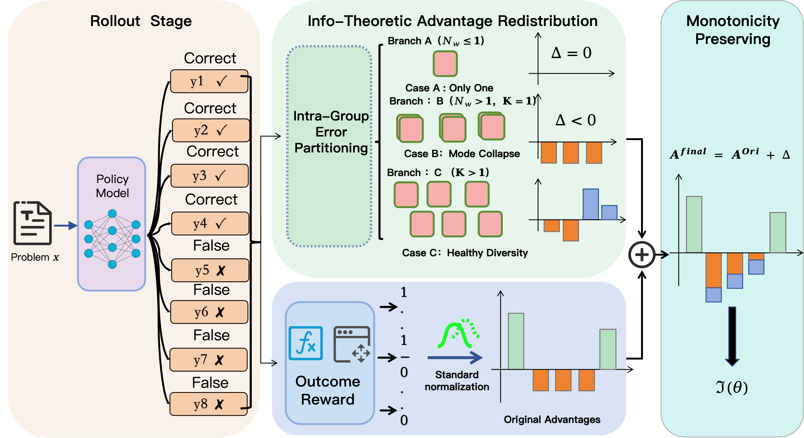
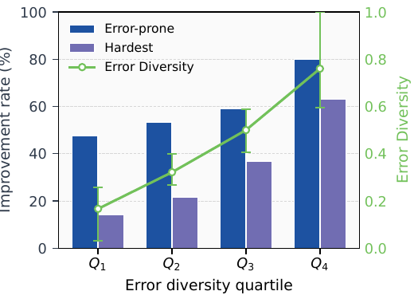
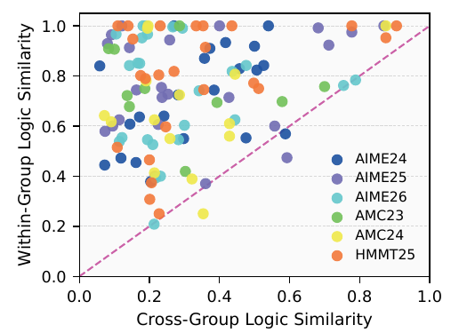
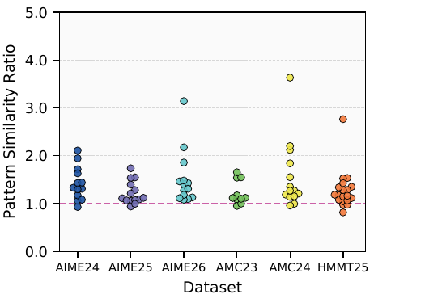
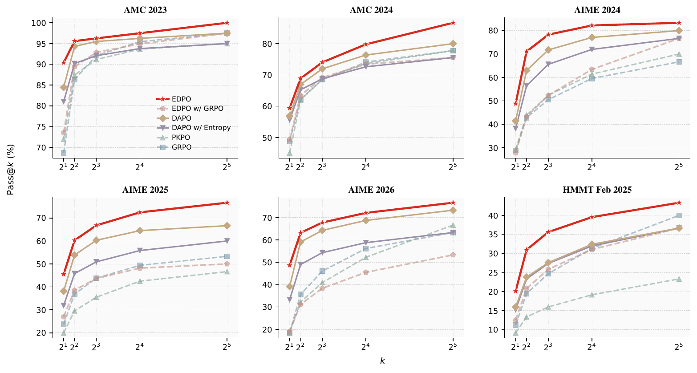
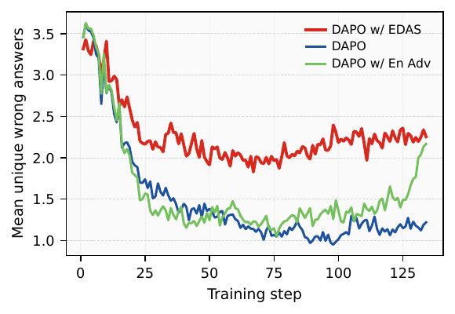
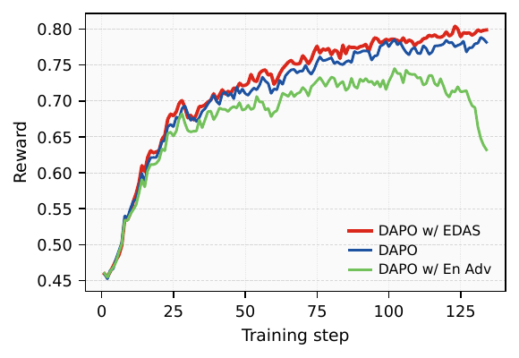

<h1 align="center">EDAS: Error Diversity Advantage Shaping for RLVR</h1>

<p align="center">
  <i>Leveraging Error Diversity in Group Rollouts for Reinforcement Learning</i>
</p>

<p align="center">
  <a href="https://arxiv.org/abs/2605.17333">
    
  </a>
  &nbsp;
  
  &nbsp;
  <a href="https://github.com/today-still-sleep-early/EDAS">
    
  </a>
</p>

This repository contains the reference implementation of **EDAS (Error Diversity Advantage Shaping)**, an RLVR framework that reshapes per-sample advantages of incorrect trajectories based on intra-group error diversity during reinforcement learning training for LLM reasoning. Built on top of the [verl](https://github.com/verl-project/verl) RLHF / RLVR framework.

<p align="center">
  
</p>

<p align="center"><em>EDAS reshapes per-sample advantages of <strong>incorrect</strong> trajectories based on intra-group error diversity: penalize mode collapse, encourage rare/exploratory failures, preserve correct trajectories untouched.</em></p>

EDAS is a lightweight, algorithm-agnostic advantage-shaping module for **Reinforcement Learning from Verifiable Rewards (RLVR)**. After any group-relative algorithm (GRPO / DAPO / …) finishes its standard advantage normalization, EDAS inspects the **distribution of wrong answers within each group** and reshapes the advantage of incorrect trajectories:

- **Mode collapse** (all wrong answers identical) → apply a uniform extra penalty so the policy escapes the entrenched failure mode.
- **Healthy diversity** (multiple distinct wrong answers) → redistribute penalties using normalized relative surprisal: dominant errors get amplified penalties, rare/exploratory errors get attenuated penalties.
- **Insufficient statistics** (≤1 wrong sample) → no change.

A `κ`-clipping step guarantees the sign of the original advantage is never flipped — incorrect trajectories always receive non-positive gradient signal.

---

## ✨ Highlights

| Benchmark family (Qwen3-8B, 7 math benchmarks) | DAPO | **DAPO + EDAS** | Δ |
|---|---|---|---|
| Average | 47.82 | **54.11** | **+6.29** |
| AIME 2024 | 41.46 | **48.85** | +7.39 |
| AIME 2025 | 38.12 | **45.52** | +7.29 |
| AIME 2026 | 39.17 | **48.65** | +9.48 |
| HMMT 25 | 15.94 | **20.10** | +4.16 |
| AMC 23 | 84.45 | **90.39** | +5.94 |

- **+6.29 / +1.89 / +9.88** avg-points over DAPO on Qwen3-8B / 4B / 4B-Base.
- **+1.45** avg-points on code generation (4 benchmarks, Qwen3-4B).
- Drop-in: only touches per-sample advantage **after** GRPO standardization. No new model parameters, no extra forward/backward pass, no change to sampling or loss.

---

## 🧠 Motivation

Empirically, the **diversity of wrong answers in a rollout group is a strong predictor of whether RLVR will improve the model on that problem**. Groups with diverse failures gain substantially more; groups with homogeneous failures stall.

<p align="center">
  
  
  
</p>

**(left)** Improvement rate (the share of problems with rising Average Pass Rate) increases monotonically across error-diversity quartiles. **(middle)** Trajectories sharing the same wrong answer share the same logical root 94% of the time (above-diagonal points). **(right)** Trajectories with the same wrong answer have higher within-group than between-group 3-gram similarity — error answer == reasoning path.

Conclusion: **the wrong-answer distribution carries actionable structure that vanilla GRPO/DAPO discards**.

---

## 🔧 Method at a glance

(See framework figure at the top of this README.)

Let $\mathcal{W}$ be the index set of incorrect trajectories in a group, $N_w = |\mathcal{W}|$. Partition $\mathcal{W}$ into $K$ equivalence classes via a domain-specific error-equivalence function $\mathcal{E}$ (math: canonicalized boxed answer; code: Python exception type). Let $p_k = |C_k|/N_w$, $I_i = -\ln p_k$ (self-information), $H = -\sum_k p_k \ln p_k$ (Shannon entropy), and $S = \tfrac{1}{N_w}\sum_{i\in\mathcal{W}} |A_i^{\text{orig}}|$ (dynamic scale).

$$
\Delta_i = \begin{cases}
0 & N_w \le 1 \quad\text{(A: insufficient stats)} \\
-\beta \cdot S & N_w > 1,\ K = 1 \quad\text{(B: error perseveration)} \\
\alpha \cdot S \cdot \dfrac{I_i - H}{\ln N_w} & K > 1 \quad\text{(C: healthy diversity)}
\end{cases}
$$

Then a monotonicity-preserving clip:

$$
A_i^{\text{final}} = A_i^{\text{orig}} + \mathrm{sgn}(\Delta_i) \cdot \min\left(|\Delta_i|,\ \frac{|A_i^{\text{orig}}|}{\kappa}\right), \quad \kappa > 1
$$

Properties:
- **Bounded surprisal**: $T_i = (I_i - H)/\ln N_w \in [-1, 1]$.
- **Zero-sum in Branch C**: $\sum_{i\in\mathcal{W}} T_i = 0$, so the arithmetic mean of advantages is preserved — EDAS does not bias the base estimator.
- **No sign inversion**: $\kappa > 1 \Rightarrow \mathrm{sgn}(A_i^{\text{final}}) = \mathrm{sgn}(A_i^{\text{orig}})$.

---

## 📈 Results

### Main results — Math reasoning (7 benchmarks)

| Method | AMC23 | AMC24 | AIME24 | AIME25 | AIME26 | HMMT | Olympiad | **Avg.** |
|---|---|---|---|---|---|---|---|---|
| **Qwen3-8B baseline** | 67.03 | 44.24 | 23.85 | 20.00 | 15.10 | 10.42 | 54.75 | 33.63 |
| + GRPO | 68.67 | 48.75 | 28.85 | 23.75 | 18.43 | 11.25 | 57.57 | 36.75 |
| + PKPO | 71.95 | 45.07 | **29.16** | 20.00 | 18.85 | 12.08 | 58.90 | 36.57 |
| **+ GRPO w/ EDAS** | **73.52** | **49.38** | 27.81 | **26.98** | **19.06** | **12.50** | **59.20** | **38.35** |
| + DAPO | 84.45 | 56.88 | 41.46 | 38.12 | 39.17 | 15.94 | 58.75 | 47.82 |
| + DAPO w/ Entropy Adv | 81.02 | 55.62 | 31.81 | 38.23 | 33.23 | 15.21 | 58.31 | 44.78 |
| **+ DAPO w/ EDAS** | **90.39** | **59.38** | **48.85** | **45.52** | **48.65** | **20.10** | **65.88** | **54.11** |
| **Qwen3-4B + DAPO** | 85.70 | 57.15 | 47.50 | 43.54 | 40.73 | 22.40 | 65.88 | 51.84 |
| **+ DAPO w/ EDAS** | **88.59** | **58.19** | 46.46 | **48.12** | **44.27** | **23.12** | **67.36** | **53.73** |
| **Qwen3-4B-Base + DAPO** | 60.00 | 33.68 | 12.81 | 18.02 | 10.73 | 8.33 | 46.44 | 27.14 |
| **+ DAPO w/ EDAS** | **72.73** | **48.68** | **24.17** | **25.21** | **20.97** | **10.94** | **56.50** | **37.02** |

### Pass@k

<p align="center">
  
</p>

EDAS w/ DAPO dominates across $k \in \{2, 4, 8, 16, 32\}$ on all six benchmarks. The gap widens with $k$ on the harder benchmarks (AIME 25/26, HMMT) — diversity-promoting penalties translate directly to broader coverage of correct solutions.

### Training dynamics

<p align="center">
  
  
</p>

**(left)** Mean unique wrong answers per group across training. DAPO's error diversity collapses rapidly; EDAS sustains it. **(right)** Reward curves (0.5 exponential smoothing): EDAS reaches a higher asymptotic reward at a faster growth rate than DAPO and DAPO + Entropy Adv.

### Bottleneck breakthroughs (Qwen3-8B)

| Benchmark | Hard (Total) | DAPO Break | **EDAS Break** | EDAS-only |
|---|---|---|---|---|
| AIME 2025 | 15 | 6 | **9** | 3 |
| AIME 2026 | 15 | 7 | **8** | 1 |
| AMC 2024 | 13 | 5 | **7** | 3 |
| HMMT Feb 25 | 21 | 4 | **6** | 3 |
| **Total** | **64** | **22** | **30** | **10** |
| **Rate** | 0% | 34.4% | **46.9%** | **+12.5%** |

EDAS solves 30/64 problems on which the base model was at 0% APR — **+36% relative breakthrough rate** over DAPO, and **10 problems uniquely solvable by EDAS**.

### Code generation (Qwen3-4B)

| Method | LiveCodeBench | Codeforces | HumanEval+ | MBPP+ | **Avg.** |
|---|---|---|---|---|---|
| + DAPO | 31.21 | 42.42 | 79.88 | 63.23 | 54.19 |
| **+ DAPO w/ EDAS** | **32.07** | **45.97** | **80.49** | **64.02** | **55.64** |
| Δ | +0.86 | +3.55 | +0.61 | +0.79 | **+1.45** |

For code, $\mathcal{E}$ maps each failure to its Python exception type — the rest of the EDAS pipeline is unchanged.

---

## 🛠 Implementation

We implement EDAS on top of the [verl](https://github.com/verl-project/verl) framework so it can be plugged into either **GRPO** or **DAPO** out of the box. The EDAS subroutine (three-branch advantage redistribution + κ-clip + warmup scheduling) is added as a post-hoc step right after group-relative advantage standardization, with the rest of the training pipeline untouched. Math reward (rule + sympy + optional LLM judge), prompt-format jinja, and vLLM rollout with dynamic per-prompt `max_tokens` are wired through verl's native components.

### Configuration knobs

| Knob | Default | Notes |
|---|---|---|
| `algorithm.branch_adv_enabled` | `False` | Master switch |
| `algorithm.branch_adv_alpha` | `0.2` (`0.4` in our scripts) | Branch C diversity gain, recommended `[0.1, 0.5]` |
| `algorithm.branch_adv_beta` | `0.2` (`0.3` in DAPO script) | Branch B collapse penalty, recommended `[0.1, 0.5]` |
| `algorithm.branch_adv_kappa` | `2.0` | κ-clip margin, must be `>1`; larger = more conservative |
| `algorithm.branch_adv_log_path` | `null` | Relative to `trainer.default_local_dir`; per-step adjustment log |

---

## 🚀 Quickstart

### Prerequisites

- 8× H100 / H200 / A100 GPUs (we trained on 8× H200)
- A working verl + vLLM environment (Python 3.10+, with `mathruler` and `swanlab` installed)
- Model checkpoints (Qwen3-8B / 4B / 4B-Base, …) and training data (DAPO-Math-17k, AIME / AMC / HMMT / Olympiad val sets, …) downloaded locally

### Step 1 — Render the prompt-format jinja into the training parquet (once)

verl uses `tokenizer.apply_chat_template`, so the system-prompt jinja layer needs to be pre-rendered into the parquet's `prompt` column:

```bash
python3 examples/branch_adv/preprocess_parquet.py \
  --input  /path/to/DAPO-Math-17k-Processed/train.parquet \
  --output /path/to/DAPO-Math-17k-Processed/train.formatted.parquet \
  --template examples/branch_adv/format_prompt/math_wo_format.jinja \
  --split train

python3 examples/branch_adv/preprocess_parquet.py \
  --input  /path/to/val_merge/val_merged.parquet \
  --output /path/to/val_merge/val_merged.formatted.parquet \
  --template examples/branch_adv/format_prompt/val_wo_format.jinja \
  --split val
```

`--split val` tags val rows so the reward function (`compute_score_batch`) routes them through rule-only scoring (no sympy / LLM judge on the val set).

### Step 2 — Train: DAPO + EDAS on Qwen3-8B

```bash
bash examples/branch_adv/run_dapo_branch_adv.sh \
  --model_path /path/to/Qwen/Qwen3-8B \
  --train_data /path/to/DAPO-Math-17k-Processed/train.formatted.parquet \
  --val_data   /path/to/val_merge/val_merged.formatted.parquet \
  --task_name  qwen3_8b_dapo_edas \
  --output_path ./ckpt \
  --gpus 8 \
  --max_prompt_length 2048 \
  --max_response_length 8192 \
  --branch_adv_enabled True \
  --branch_adv_alpha 0.4 \
  --branch_adv_beta 0.3 \
  --branch_adv_kappa 2.0 \
  --swanlab_project edas-math --swanlab_mode cloud
```

### Step 3 — Monitor

During training, EDAS publishes `branch_adv/*` series to SwanLab (warmup scale, # groups processed, branch B/C counts, mean Δ, collapse rate). If `--branch_adv_log_path` is set, per-step per-group adjustment details are appended to a log under `${output_path}/${experiment_name}/`.

---

## 📐 Hyperparameter recipe (used in paper)

| Hparam | Math (all 3 models) |
|---|---|
| α (diversity gain) | 0.4 |
| β (collapse penalty) | 0.2 (DAPO 0.3) |
| κ (clip margin) | 2.0 |
| rollout n | 10 |
| train batch size (prompts) | 256 |
| max_prompt_length | 2048 |
| max_response_length | 8192–10240 |
| LR (actor) | 1e-6 |
| ppo_mini_batch | 64 |
| GPUs | 8× H200 |

---

## 📁 Repository layout

```
verl/
├── README.md                                  # ← this file
├── assets/edas/                               # Figures used in this README
│   ├── framework.png
│   ├── motivation_*.png
│   ├── passk_benchmarks.png
│   ├── reward_curves.png
│   └── error_diversity_curve.png
├── examples/branch_adv/
│   ├── run_dapo_branch_adv.sh                 # DAPO + EDAS launcher
│   ├── run_grpo_branch_adv.sh                 # GRPO + EDAS launcher
│   ├── run_8b_non_thinking_04_30_20_wo_format_17k.sh   # Paper config
│   ├── preprocess_parquet.py                  # Jinja prerender tool
│   ├── format_prompt/                         # Math / val system-prompt jinja
│   ├── llm_judge_prompt/                      # Math / SQA LLM-judge prompts
│   └── reward_function/                       # math_no_format / val_wo_format / llm_judge
├── verl/                                      # verl framework (extended for EDAS)
│   ├── trainer/
│   │   ├── config/algorithm.py                # +branch_adv_* fields
│   │   ├── config/ppo_trainer.yaml            # +algorithm.branch_adv_* defaults
│   │   ├── ppo/core_algos.py                  # +_apply_branch_advantage_adjustment
│   │   └── ppo/ray_trainer.py                 # +warmup-scale + branch_adv wiring
│   └── workers/
│       ├── config/rollout.py                  # +enable_dynamic_max_tokens / length_log_*
│       └── rollout/vllm_rollout/vllm_async_server.py  # honor enable_dynamic_max_tokens
└── recipe/dapo/                               # verl's DAPO recipe (entry point reused as-is)
```

---

## 📝 Notes & caveats

- **verl rollout path**: this implementation targets the async-server vLLM path (`vllm_async_server.py`). The SPMD path was retired upstream in PR #4411 and now raises `NotImplementedError`. `actor_rollout_ref.rollout.mode=async` is the yaml default — don't override to `sync`.
- **`gen_batch_size = train_batch_size × 2`**: matches verl's official `recipe/dapo` over-rollout default. Over-rolling out by 2× absorbs DAPO's `filter_groups` discards without triggering retries (controlled by `algorithm.filter_groups.max_num_gen_batches`). Pass `--gen_batch_size <train_batch_size>` to disable over-rollout.
- **Validation reward**: verl exposes one `custom_reward_function`. We route train vs. val rows by checking `extra_info["split"]` inside `compute_score_batch`. **You must pass `--split val` to the preprocessor** so val rows are tagged accordingly; otherwise val rows will go through sympy + LLM judge (correct but slow & costly).
- **LLM judge defaults** (host / ports / model / endpoint / timeout / retries / max_workers / max_tokens) are environment-variable driven. Override via `LLM_JUDGE_*` env, the `--llm_judge_*` CLI flags, or Hydra overrides.
- **Math equivalence** is decided by `mathruler.grader.grade_answer` (e.g. `"42" ≡ "42.0"`), not embedding similarity — see Appendix A in the paper for why embedding alternatives fail on math.

---

## 🎓 Citation

```bibtex
@article{edas2026,
  title         = {Leveraging Error Diversity in Group Rollouts for Reinforcement Learning},
  author        = {Anonymous},
  year          = {2026},
  eprint        = {2605.17333},
  archivePrefix = {arXiv},
  primaryClass  = {cs.LG},
  url           = {https://arxiv.org/abs/2605.17333}
}
```

---

## 🙏 Acknowledgements

- Built on [verl](https://github.com/verl-project/verl) — the underlying RLHF / RLVR framework.
- LLM-judge inference is served through vLLM-compatible OpenAI-style endpoints.

---

## 📜 License

Same as upstream verl (Apache-2.0). See [LICENSE](LICENSE).
